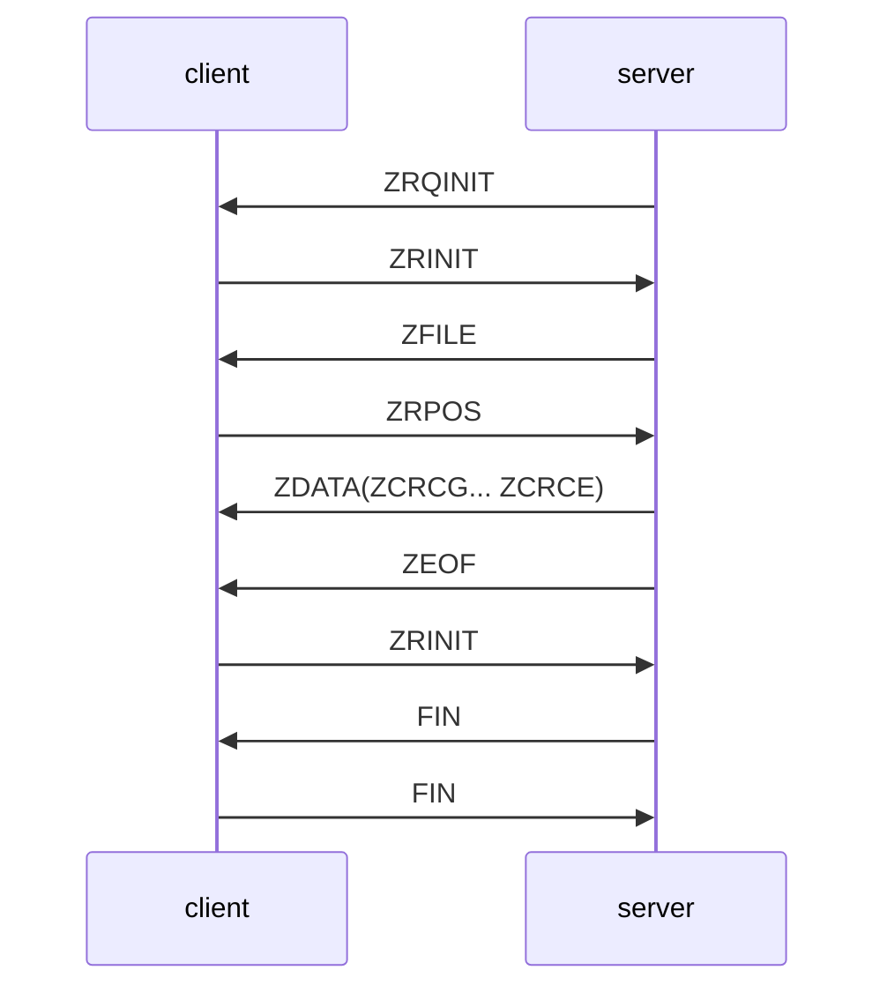
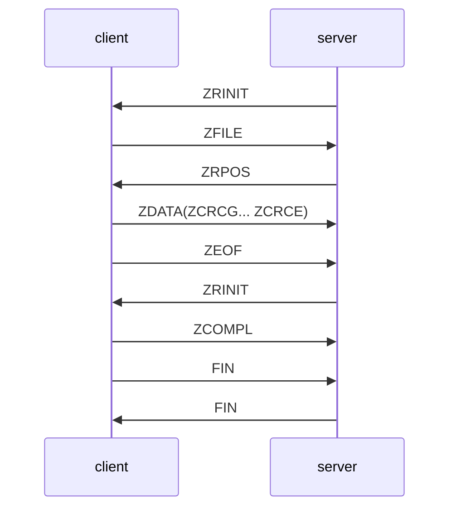
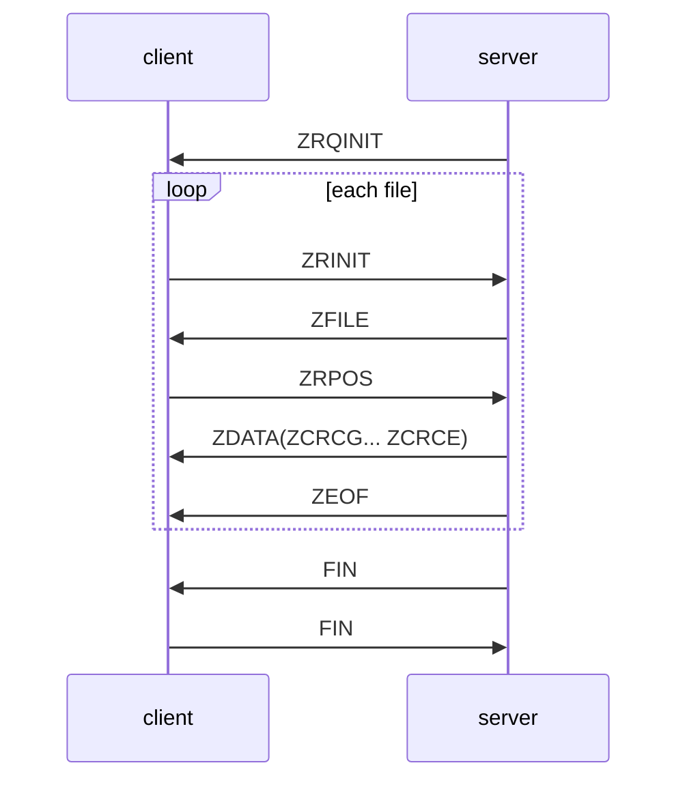
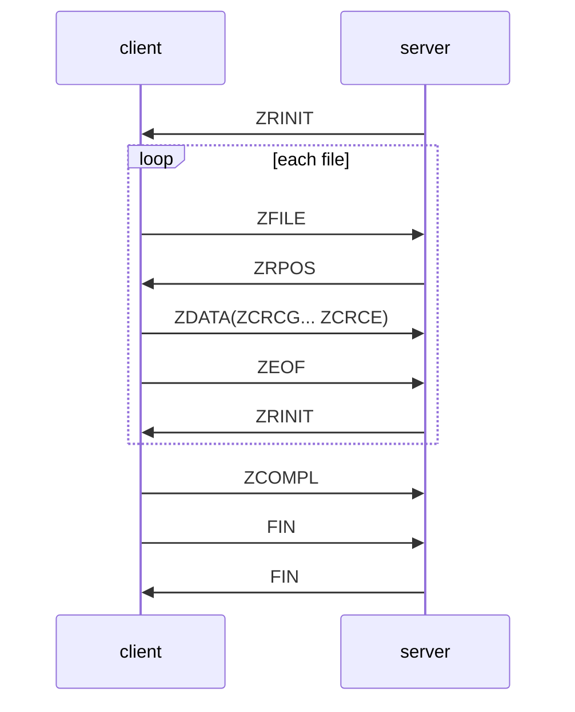
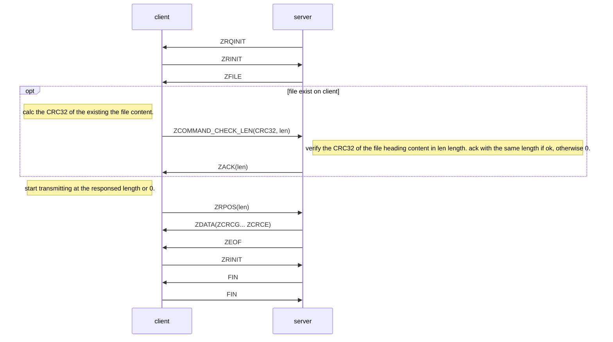
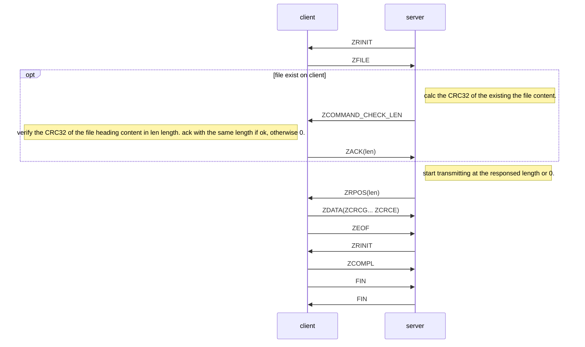

# 1. Overview
As well-known, [lrzsz](https://ohse.de/uwe/software/lrzsz.html) is a very handy tool to transfer files along with the existing terminal. It is so convenient that after I implemented the ZMODEM feature in [putty-nd](https://noodle1983.github.io/tags/putty-nd), I seldom use other tools to transfer files.

Then, why do I make another implementation of it? Well, as a user, I have a lot of thinking, like what if it can blablabla or why can't it be blablabla. Those thinking keep following me and someday I couldn't stand for it and downloaded its source code. Sadly I gave up before I got drowned in the source code(Sorry to say that, it is my problem). And the worst thing is, this happened again and again. To get out of this dilemma, I decide to re-implement it again.

I have some tools on hand, the FSM and the multi-jobs Processor in C++. So it is written in C++. I have written build scripts in plain Makefile, so it is not autoconf. It is a utility tool, which means it must not occupy lots of resources from the other logical server. So it is a single thread.

As it is a long time after the ZMODEM protocol was invented, rzsz-nd starts from a basic feature, which is sending/receiving plain file in ZMODEM, without any conversion and encryption. For the other features in ZMODEM or YMODEM/XMODEM, will be gone with the wind if no one bring it back in the future. I have implemented some more features and protocol extensions, which are detailed in the following chapter.

All the sequence diagrams are written in [mermaid](https://mermaid-js.github.io/mermaid/#/). A better formatted version of this file can be reached via [my blog](https://noodle1983.github.io/2021/02/12/rzsz-nd_README/).

# 2. Features

## 2.1. Normal Zmodem Workflow
The original ZMODEM protocol is available via the [link](http://gallium.inria.fr/~doligez/zmodem/zmodem.txt) or [the markdown version](https://github.com/noodle1983/rzsz-nd/blob/main/doc/zmodem.md). And the simple workflow comes follows.

### sz workflow



### rz workflow


# 2.2 sz/rz directory
The feature is already supported in the ZMODEM protocol. I just send the relative path of the file as its filename. The server/client check the '/' character and make the directory. However, the empty directory is ignored at the moment.

### sz workflow




### rz workflow


# 2. large file(>4 GB)
The file cursor position in ZMODEM protocol message(ZRPOS/ZDATA/ZACK/ZEOF) is defined as 4 bytes, which limits the file size max to 4 GB. In order to achieve this feature, a 64bit binary frame with CRC32 is defined. When the cursor position is larger than 4 GB, the 64bit binary frame will be used while the rest is as it was.
```
#define ZBIN64 'D'
struct frame64_tag{
    unsigned char type;
    unsigned char flag[8];
    uint32_t crc;
};
typedef struct frame64_tag frame64_t;
```

# 3. resume the transmission
2 extra messages ZCOMMAND(ZCOMMAND_CHECK_LEN) and ZACK(pos) are involved.

### sz workflow


### rz workflow


# 4. update working directory
The options are added to update client/server working directory, and preset the rz files to avoid the file selection. Please refer to the usage chapter for the details.

# 5. How to build

Type make to build release version. And make install to install it to /usr/local/bin.
```
make
make install
```

Type make debug to build a debug version.
```
make debug
```

# 6. Usage

### sz
```
[ludong@VM-0-17-centos rzsz-nd]$ ./sz --help

USAGE:

   ./sz  [-s <directory path>] [-c <directory path>] [-l <filename>] [-d
         <int:0-5>] [--] [--version] [-h] <string[]> ...


Where:

   -s <directory path>,  --server-working-dir <directory path>
     Depending on ZVERSION:1, set the working directory on the server side.
     It is current directory if not set.

   -c <directory path>,  --client-working-dir <directory path>
     Depending on ZVERSION:1, set the working directory on the client side.
     It is desktop if not set.

   -l <filename>,  --log <filename>
     File to log

   -d <int:0-5>,  --debug <int:0-5>
     set debug level. 0: TRACE; 1: DEBUG; 2: INFO; 3: WARN; 4: ERROR; 5:
     FATAL;

   --,  --ignore_rest
     Ignores the rest of the labeled arguments following this flag.

   --version
     Displays version information and exits.

   -h,  --help
     Displays usage information and exits.

   <string[]>  (accepted multiple times)
     (required)  files to sent


   Send file(s) with ZMODEM protocol.

```
-----------
### rz
```
[ludong@VM-0-17-centos rzsz-nd]$ ./rz --help

USAGE:

   ./rz  [-f] [-p <directory/file path>] [-s <directory path>] [-c
         <directory path>] [-l <filename>] [-d <int:0-5>] [--] [--version]
         [-h]


Where:

   -f,  --rz-folder-mode
     rz folder mode, make client to select folder.

   -p <directory/file path>,  --preset-files <directory/file path>
     Depending on ZVERSION:1, preset rz files splited by '#' to skip file
     selection

   -s <directory path>,  --server-working-dir <directory path>
     Depending on ZVERSION:1, set the working directory on the server side.
     It is current directory if not set.

   -c <directory path>,  --client-working-dir <directory path>
     Depending on ZVERSION:1, set the working directory on the client side.
     It is desktop if not set.

   -l <filename>,  --log <filename>
     File to log

   -d <int:0-5>,  --debug <int:0-5>
     set debug level. 0: TRACE; 1: DEBUG; 2: INFO; 3: WARN; 4: ERROR; 5:
     FATAL;

   --,  --ignore_rest
     Ignores the rest of the labeled arguments following this flag.

   --version
     Displays version information and exits.

   -h,  --help
     Displays usage information and exits.


   Receive file(s) with ZMODEM protocol.

```

# 7. License
Except for extra permissions from Dong Lu(noodle1983@126.com), this software is released under version 3 of the GNU General Public License (GPLv3).

### other modules
 module | license
---|---
[tclap](http://tclap.sourceforge.net/) | MIT License
[base64](https://github.com/altera-opensource/linux-socfpga/blob/e36e7a90783f05a2f877c75d9f8e2725e87cb9f4/include/linux/base64.h#L13) | GPL-2.0
[flatbuffers](https://github.com/google/flatbuffers) | Apache-2.0
[lz4](https://github.com/lz4/lz4) | BSD 2-Clause license
[{fmt}](https://github.com/fmtlib/fmt) | MIT License


# 8. Support
[Github](https://github.com/noodle1983/rzsz-nd/issues)
